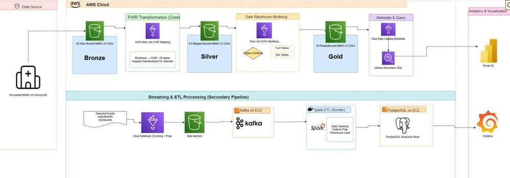

# 🫀 PulseBridge
### Cloud-Based Healthcare Analytics Platform & Data Lakehouse


> **PulseBridge** is an end-to-end, cloud-native healthcare data lakehouse built on AWS that transforms raw clinical records from the MIMIC-III database into actionable, FHIR-compliant analytics. It combines a medallion lakehouse architecture (Bronze → Silver → Gold) with a real-time streaming pipeline to power operational ICU monitoring dashboards in Grafana and executive-level insights in Power BI.

---

## 📋 Table of Contents

- [Overview](#-overview)
- [Architecture](#-architecture)
  - [Primary Pipeline — Medallion Lakehouse](#primary-pipeline--medallion-lakehouse-aws-glue--athena--power-bi)
  - [Secondary Pipeline — Streaming & ETL](#secondary-pipeline--streaming--etl-kafka--spark--postgresql--grafana)
- [Key Features](#-key-features)
- [Dashboards & Visualizations](#-dashboards--visualizations)
  - [Grafana — Real-Time ICU Monitoring](#grafana--real-time-icu-monitoring)
  - [Power BI — Executive Analytics](#power-bi--executive-analytics)
- [Tech Stack](#-tech-stack)
- [Data Source — MIMIC-III](#-data-source--mimic-iii)
- [Project Structure](#-project-structure)
- [Getting Started](#-getting-started)
  - [Prerequisites](#prerequisites)
  - [Environment Setup](#1-environment-setup)
  - [Primary Pipeline Deployment](#2-deploy-the-primary-pipeline-medallion-lakehouse)
  - [Secondary Pipeline Deployment](#3-deploy-the-secondary-pipeline-streaming--etl)
  - [Connect Dashboards](#4-connect-dashboards)
- [Data Model](#-data-model)
- [Security & Compliance](#-security--compliance)
- [Performance & Scale](#-performance--scale)
- [Roadmap](#-roadmap)
- [Contributing](#-contributing)
- [License](#-license)
- [Acknowledgements](#-acknowledgements)

---

## 🔍 Overview

Healthcare data is fragmented, high-volume, and time-critical. PulseBridge solves this by implementing a **dual-pipeline architecture** on AWS that:

1. **Ingests** raw MIMIC-III clinical CSVs from a PhysioNet source database.
2. **Transforms** them through a FHIR-compliant medallion lakehouse (Bronze → Silver → Gold) using AWS Glue, producing structured fact and dimension tables queryable via Amazon Athena.
3. **Streams** selected high-frequency clinical events (output events, chart events) through Kafka → Spark ETL → PostgreSQL for sub-minute operational latency.
4. **Visualizes** the results through two complementary BI layers: Grafana for real-time ICU monitoring and Power BI for strategic population-level analytics.

The platform processes data for **~47K+ patients**, **59K+ admissions**, **212+ unique clinical measures**, and supports multi-year, multi-quarter filtering with drill-down to the individual ICU stay level.

---

## 🏗️ Architecture





### Primary Pipeline — Medallion Lakehouse (AWS Glue + Athena + Power BI)

The primary pipeline implements a classic **Bronze → Silver → Gold** data lakehouse pattern, adapted for healthcare data with HL7 FHIR compliance at the Silver layer.

| Layer | Storage | Transformation | Output |
|---|---|---|---|
| **Bronze** | S3 Raw Bucket | Raw ingestion, no changes | MIMIC-III CSVs as-is |
| **Silver** | S3 Mapped Bucket | AWS Glue FHIR Mapping Job | 26 FHIR-standardized tables (Relational → FHIR) |
| **Gold** | S3 Ready Bucket | AWS Glue DWH Modeling Job | Galaxy Schema — Fact Tables + Dimension Tables |
| **Query** | Glue Data Catalog | Athena Serverless SQL | Ad-hoc SQL interface for Power BI |

**FHIR Mapping** at the Silver layer converts MIMIC-III relational tables into HL7 FHIR R4 resource representations, enabling interoperability and standards compliance. The 26 mapped tables cover Patient, Encounter, Observation, Condition, MedicationAdministration, Procedure, and more.

**Galaxy Schema** at the Gold layer organizes data into a query-optimized star/galaxy schema with central fact tables (`fact_admissions`, `fact_chartevents`, `fact_outputevents`) linked to shared dimension tables (`dim_patients`, `dim_diagnoses`, `dim_icu_stays`, `dim_items`, `dim_time`).

### Secondary Pipeline — Streaming & ETL (Kafka + Spark + PostgreSQL + Grafana)

The secondary pipeline handles the **high-frequency, low-latency** clinical data streams that require near-real-time availability for ICU monitoring.

```
Selected Events                   Kafka on EC2          Spark ETL (Docker)
(outputevents,    ──▶  Glue    ──▶  (data        ──▶   ├─ Data Cleaning
 chartevents)        Notebook       batches)             ├─ Feature Preparation
                    (Chunk+Prep)                         └─ Warehouse Load
                                                                │
                                                                ▼
                                                     PostgreSQL on EC2
                                                     (Analytical Store)
                                                                │
                                                                ▼
                                                           Grafana
                                                    (Real-Time Dashboards)
```

Key design decisions in the secondary pipeline:

- **Kafka on EC2** provides durable, ordered, partitioned event streaming. Selected MIMIC-III tables (chartevents, outputevents) are chunked by a Glue Notebook and published as data batches to Kafka topics.
- **Spark ETL in Docker** runs on EC2 with containerized isolation, performing data cleaning (type coercion, null handling, deduplication), feature engineering (rolling averages, derived vitals), and direct load into PostgreSQL.
- **PostgreSQL on EC2** serves as the operational analytical store optimized for Grafana's time-series and per-patient queries, with indexes on `(subject_id, icustay_id, charttime)`.

---

## ✨ Key Features

- **Dual-pipeline architecture** — batch lakehouse for historical/strategic analytics, streaming pipeline for operational/real-time monitoring
- **FHIR R4 compliance** — Silver layer produces HL7 FHIR-mapped tables, enabling interoperability with EHR systems
- **Galaxy schema data warehouse** — Gold layer optimized for BI tools with pre-computed aggregations
- **Per-patient, per-ICU-stay drill-down** — Grafana dashboards filter to individual `subject_id`, `icustay_id`, and `Output_item` with dynamic variable injection
- **212+ unique clinical measures** tracked across vital signs, fluid outputs, medications, and procedures
- **Multi-year, multi-quarter filtering** in Power BI (2100, 2101, 2102 across Q1–Q4)
- **Real-time ICU event monitoring** with hourly trend lines, output distribution charts, and gauge indicators
- **Population-level analytics** covering 47K+ patients, 59K+ admissions, diagnosis distributions, mortality rates, and ICU performance
- **Containerized Spark ETL** for reproducible, portable processing
- **Serverless querying** via Amazon Athena — no cluster management for the primary analytical workload

---

## 📊 Dashboards & Visualizations

### Grafana — Real-Time ICU Monitoring

Two operational Grafana dashboards provide per-patient, per-stay clinical visibility:

#### ChartEvents Dashboard
Monitors high-frequency vital sign recordings for a specific ICU stay.

- **Top Output Items** — ranked horizontal bar chart showing the most recorded chart items (Heart Rate: 19,276 events; Non-Invasive Blood Pressure systolic: 16,183; O2 saturation: 16,106)
- **Total Events** — real-time KPI card (e.g., **5,560** events for the filtered stay)
- **Unique Measures** — count of distinct clinical measures recorded (**212**)
- **Hourly Output Trend by Item** — time-series line chart across the ICU stay window
- **Output Distribution** — normalized stacked bar chart showing avg/max/min output per selected item

**Dashboard Variables:** `query0`, `subject_id`, `icustay_id`, `Output_item` — all dynamically injectable via Grafana template variables.

**Example Query Window:** `2104-09-24 03:00:00` to `2104-09-26 03:00:00`

#### OutputEvents Dashboard
Monitors fluid and clinical output measurements.

- **Top Output Items** — Urine Out Foley (10,902), Chest Tubes CTICU CT 2 (1,390), Chest Tubes CTICU CT 1 (760)
- **Total Events** — **244** for the filtered stay
- **Monitored Days / Hours** — **7.14 days / 171 hours**
- **Average Hourly Output Gauge** — radial gauge showing **87.7** avg hourly output
- **Hourly Output Trend** — time-series over the full monitoring window (March–November span for this stay)
- **Output Distribution** — per-item avg/max/min comparison

**Example:** `subject_id: 10027`, `icustay_id: 286020`, monitoring window `2190-03-21` to `2190-11-08`


### Power BI — Executive Analytics

Four interlinked Power BI report pages provide population-level strategic insight, all filterable by **Year** (2100–2102) and **Quarter** (Q1–Q4).

#### Patient Page
High-level demographic overview of the patient population.

| Metric | Value |
|---|---|
| Average Age | 66 |
| Total Patients | 47K |
| Total Diagnoses | 16K |

- **Patient Distribution by Race** — pie chart (White: 80.53%, African American: 11.26%, Hispanic/Latino: 4.17%, Asian: 3.91%, Native American: 0.14%)
- **Patient Distribution by Status** — pie chart (Married: 49.99%, Single: 27.33%, Widowed: 14.87%, Divorced: 6.63%, Separated: 1.18%)
- **Patient Distribution by Gender** — donut chart (Female: 56.15% / 26.1K; Male: 43.85% / 20.4K)
- **Patient Distribution by Age Group** — bar chart (Elderly/Old: 31.1K, Adult: 30.9K, Child: 8.2K)

#### Diagnosis Distribution Page
Clinical diagnosis analysis broken down by demographic cohorts.

- **Top 10 Diagnoses by Marital Status** — stacked bar chart. Leading diagnoses: Pneumonia (1,500+), Sepsis (~1,100), Congestive Heart Failure, Coronary Artery Disease, Chest Pain
- **Top 10 Diagnoses by Race** — stacked bar chart showing racial distribution within each diagnostic category; White patients dominate across all diagnoses reflecting population demographics

#### Admissions Page
Operational admissions analytics.

| Metric | Value |
|---|---|
| Total Admissions | 59K |
| Average Length of Stay (LOS) | 5 days |

- **Patient Mortality Rate** — donut chart (Alive: 89.71% / 65.84K; Dead: 10.29% / 7.56K)
- **Total Admissions by Type** — bar chart (Emergency: ~40K dominant; Newborn, Elective, Urgent in descending order)
- **Admissions Over Time** — area line chart by month (range: 5,822–6,435; peak in August at 6,435)
- **Top 10 Used Medications** — horizontal bar chart by patient percentage (NaCl 0.9% and Dextrose 5% are the most administered, followed by propofol, Insulin-Regular, Norepinephrine, fentanyl)

#### ICU Page
ICU-specific operational performance metrics.

- **Top 10 Charts Produced in ICUs** — horizontal bar chart by total patients (Heart Rate, Respiratory Rate, O2 Saturation, and Non-Invasive Blood Pressure variants dominate; range 0.1M–0.4M)
- **Average LOS by ICU Unit** — combo chart (bar = Average LOS, line = Total Patients). Units: NICU (highest LOS ~10), SICU (~5), TSICU (~3.5), MICU (~3.5, highest patient volume), CSRU (~3), CCU (~2.5)
- **ICU Rush Hours** — hourly patient activity line chart; activity peaks between 09:00–22:00 (~73.4K at peak hours), drops to minimum around 05:00–06:00
- **Heart Rate vs. ICU Length of Stay** — scatter plot showing relationship between avg heart rate (50–150 bpm) and avg LOS (0–45 days); median heart rate cluster around 75–100 bpm with most stays under 10 days; outliers extend to 40+ days

---

## 🛠️ Tech Stack

| Category | Technology | Role |
|---|---|---|
| **Cloud Platform** | AWS | Primary infrastructure |
| **Object Storage** | Amazon S3 | Bronze / Silver / Gold data layers |
| **ETL / Data Integration** | AWS Glue | FHIR mapping, DWH modeling, notebook prep |
| **Serverless Query** | Amazon Athena | SQL interface over Gold layer |
| **Metadata** | AWS Glue Data Catalog | Schema registry and table metadata |
| **Event Streaming** | Apache Kafka (EC2) | High-frequency clinical event streaming |
| **Batch Processing** | Apache Spark (Docker, EC2) | Data cleaning, feature prep, warehouse load |
| **Analytical Store** | PostgreSQL (EC2) | Operational store for Grafana |
| **BI / Visualization** | Power BI | Population analytics, executive dashboards |
| **BI / Monitoring** | Grafana | Real-time ICU monitoring dashboards |
| **Data Standard** | HL7 FHIR R4 | Clinical data interoperability standard |
| **Data Source** | MIMIC-III (PhysioNet) | De-identified clinical database |
| **Containerization** | Docker | Spark ETL isolation and portability |

---

## 📁 Data Source — MIMIC-III

MIMIC-III (Medical Information Mart for Intensive Care III) is a large, freely available de-identified health database maintained by MIT Lab for Computational Physiology. It contains data for **over 40,000 patients** admitted to the Beth Israel Deaconess Medical Center ICUs between 2001 and 2012.

> **Access Requirement:** MIMIC-III requires completing a credentialing process and signing a data use agreement through [PhysioNet](https://physionet.org/content/mimiciii/). You must complete CITI training and obtain approval before accessing the data.

Key MIMIC-III tables used in PulseBridge:

| Table | Description | Pipeline |
|---|---|---|
| `PATIENTS` | Demographics, DOB, gender | Both |
| `ADMISSIONS` | Hospital admissions, discharge disposition | Both |
| `ICUSTAYS` | ICU stay records per admission | Both |
| `CHARTEVENTS` | Vital signs and clinical observations (~330M rows) | Secondary (Streaming) |
| `OUTPUTEVENTS` | Fluid outputs (urine, drains, etc.) | Secondary (Streaming) |
| `DIAGNOSES_ICD` | ICD-9 diagnosis codes per admission | Primary |
| `PRESCRIPTIONS` | Medication administrations | Primary |
| `D_ITEMS` | Dictionary of chart/output item definitions | Both |
| `D_ICD_DIAGNOSES` | ICD-9 diagnosis code descriptions | Primary |
| `LABEVENTS` | Laboratory measurements | Primary |
| `PROCEDUREEVENTS_MV` | Procedure events from MetaVision | Primary |

---

## 📂 Project Structure

```
pulsebridge/
│
├── infrastructure/                  # AWS infrastructure-as-code
│   ├── terraform/                   # Terraform modules for S3, EC2, Glue, Athena
│   └── cloudformation/              # CloudFormation templates (alternative)
│
├── pipelines/
│   ├── primary/                     # Medallion Lakehouse Pipeline
│   │   ├── glue_jobs/
│   │   │   ├── fhir_mapping/        # Bronze → Silver FHIR transformation scripts
│   │   │   │   ├── patients_fhir.py
│   │   │   │   ├── admissions_fhir.py
│   │   │   │   ├── chartevents_fhir.py
│   │   │   │   └── ...              # 26 FHIR mapping scripts
│   │   │   └── dwh_modeling/        # Silver → Gold Galaxy Schema jobs
│   │   │       ├── fact_admissions.py
│   │   │       ├── fact_chartevents.py
│   │   │       ├── dim_patients.py
│   │   │       └── ...
│   │   └── athena/
│   │       └── queries/             # Saved Athena SQL queries
│   │
│   └── secondary/                   # Streaming & ETL Pipeline
│       ├── glue_notebooks/
│       │   └── chunking_prep.ipynb  # Glue Notebook for event selection & chunking
│       ├── kafka/
│       │   ├── producer/            # Kafka producer scripts
│       │   └── consumer/            # Kafka consumer scripts
│       ├── spark/
│       │   ├── Dockerfile           # Spark ETL container
│       │   ├── etl_chartevents.py   # Spark job: chart events cleaning & load
│       │   └── etl_outputevents.py  # Spark job: output events cleaning & load
│       └── postgres/
│           ├── schema.sql           # PostgreSQL schema DDL
│           └── indexes.sql          # Performance indexes
│
├── dashboards/
│   ├── grafana/
│   │   ├── chartevents_dashboard.json    # Grafana dashboard export
│   │   └── outputevents_dashboard.json   # Grafana dashboard export
│   └── powerbi/
│       └── PulseBridge_Analytics.pbix    # Power BI report file
│
├── docs/
│   ├── architecture_diagram.png          # Full architecture diagram
│   ├── fhir_mapping_spec.md              # FHIR mapping specifications
│   ├── data_dictionary.md                # Field-level data dictionary
│   └── data_model_erd.png                # Entity-Relationship Diagram
│
├── scripts/
│   ├── setup/
│   │   ├── bootstrap_s3.sh               # Create and configure S3 buckets
│   │   ├── upload_mimic_bronze.sh        # Upload raw MIMIC-III to Bronze S3
│   │   └── setup_kafka_ec2.sh            # Kafka setup on EC2
│   └── utils/
│       ├── data_quality_checks.py        # Great Expectations / custom checks
│       └── athena_query_runner.py        # Helper to run Athena queries via boto3
│
├── config/
│   ├── glue_job_config.yml               # Glue job parameters
│   ├── kafka_config.yml                  # Kafka broker/topic configuration
│   └── spark_config.yml                  # Spark job configuration
│
├── tests/
│   ├── unit/                             # Unit tests for ETL logic
│   └── integration/                      # End-to-end pipeline tests
│
├── .env.example                          # Environment variable template
├── requirements.txt                      # Python dependencies
├── docker-compose.yml                    # Local development stack
└── README.md
```

---

## 🚀 Getting Started

### Prerequisites

- AWS account with appropriate IAM permissions (S3, Glue, Athena, EC2)
- AWS CLI configured (`aws configure`)
- Python 3.9+
- Docker & Docker Compose
- Terraform >= 1.3 (for infrastructure provisioning)
- MIMIC-III data access approved via PhysioNet
- Grafana instance (self-hosted or Grafana Cloud)
- Power BI Desktop (for `.pbix` file)

---

### 1. Environment Setup

Clone the repository and configure your environment:

```bash
git clone https://github.com/your-org/pulsebridge.git
cd pulsebridge

# Copy and populate environment variables
cp .env.example .env
```

Edit `.env` with your configuration:

```env
# AWS
AWS_REGION=us-east-1
AWS_ACCOUNT_ID=123456789012

# S3 Buckets
S3_BRONZE_BUCKET=pulsebridge-bronze-mimic3
S3_SILVER_BUCKET=pulsebridge-silver-mimic3
S3_GOLD_BUCKET=pulsebridge-gold-mimic3

# Glue
GLUE_DATABASE_NAME=pulsebridge_catalog
GLUE_IAM_ROLE_ARN=arn:aws:iam::123456789012:role/PulseBridgeGlueRole

# Athena
ATHENA_OUTPUT_BUCKET=pulsebridge-athena-results
ATHENA_WORKGROUP=primary

# EC2 / Kafka
KAFKA_BROKER_HOST=ec2-xx-xx-xx-xx.compute-1.amazonaws.com
KAFKA_PORT=9092
KAFKA_TOPIC_CHARTEVENTS=chartevents
KAFKA_TOPIC_OUTPUTEVENTS=outputevents

# PostgreSQL
POSTGRES_HOST=ec2-yy-yy-yy-yy.compute-1.amazonaws.com
POSTGRES_PORT=5432
POSTGRES_DB=pulsebridge_ops
POSTGRES_USER=pulsebridge
POSTGRES_PASSWORD=your_secure_password

# Grafana
GRAFANA_URL=http://your-grafana-host:3000
GRAFANA_API_KEY=your_grafana_api_key
```

Install Python dependencies:

```bash
pip install -r requirements.txt
```

---

### 2. Deploy the Primary Pipeline (Medallion Lakehouse)

**Step 2a: Provision Infrastructure**

```bash
cd infrastructure/terraform
terraform init
terraform plan -out=tfplan
terraform apply tfplan
```

This creates the S3 buckets, Glue IAM roles, Glue Data Catalog database, and Athena workgroup.

**Step 2b: Bootstrap S3 and Upload Bronze Data**

Ensure your MIMIC-III CSV files are available locally, then upload to the Bronze S3 bucket:

```bash
# Create bucket structure
bash scripts/setup/bootstrap_s3.sh

# Upload raw MIMIC-III CSVs to Bronze layer
bash scripts/setup/upload_mimic_bronze.sh --source /path/to/mimic-iii-csvs/ \
  --bucket $S3_BRONZE_BUCKET
```

**Step 2c: Run FHIR Mapping (Bronze → Silver)**

Deploy and run the Glue FHIR mapping jobs:

```bash
# Deploy all Glue FHIR mapping jobs
aws glue create-job --cli-input-json file://pipelines/primary/glue_jobs/fhir_mapping/job_definitions.json

# Start the FHIR mapping workflow
aws glue start-workflow-run --name pulsebridge-fhir-mapping
```

Monitor job status:

```bash
aws glue get-workflow-run --name pulsebridge-fhir-mapping --run-id <run-id>
```

**Step 2d: Run DWH Modeling (Silver → Gold)**

```bash
# Deploy DWH modeling Glue jobs
aws glue create-job --cli-input-json file://pipelines/primary/glue_jobs/dwh_modeling/job_definitions.json

# Start the DWH modeling workflow
aws glue start-workflow-run --name pulsebridge-dwh-modeling
```

**Step 2e: Verify with Athena**

```bash
# Run a validation query
python scripts/utils/athena_query_runner.py \
  --query "SELECT COUNT(*) as total_admissions FROM pulsebridge_catalog.fact_admissions" \
  --output-bucket $ATHENA_OUTPUT_BUCKET
```

---

### 3. Deploy the Secondary Pipeline (Streaming & ETL)

**Step 3a: Set Up Kafka on EC2**

```bash
bash scripts/setup/setup_kafka_ec2.sh --host $KAFKA_BROKER_HOST
```

This SSH's into the EC2 instance and installs/configures Kafka with the required topics.

**Step 3b: Set Up PostgreSQL on EC2**

```bash
# Apply the PostgreSQL schema
psql -h $POSTGRES_HOST -U $POSTGRES_USER -d $POSTGRES_DB \
  -f pipelines/secondary/postgres/schema.sql

# Apply performance indexes
psql -h $POSTGRES_HOST -U $POSTGRES_USER -d $POSTGRES_DB \
  -f pipelines/secondary/postgres/indexes.sql
```

**Step 3c: Run the Glue Notebook for Chunking & Prep**

Open the Glue Notebook in the AWS Console or run via API:

```bash
aws glue start-notebook-session \
  --session-id pulsebridge-chunking-session \
  --role $GLUE_IAM_ROLE_ARN \
  --command Name=glueetl,PythonVersion=3
```

Execute `pipelines/secondary/glue_notebooks/chunking_prep.ipynb` to select and batch `chartevents` and `outputevents` records into Kafka.

**Step 3d: Deploy and Run Spark ETL**

```bash
cd pipelines/secondary/spark

# Build the Docker image
docker build -t pulsebridge-spark-etl .

# Run chart events ETL
docker run --env-file ../../.env pulsebridge-spark-etl \
  spark-submit etl_chartevents.py

# Run output events ETL
docker run --env-file ../../.env pulsebridge-spark-etl \
  spark-submit etl_outputevents.py
```

Or with Docker Compose for local development:

```bash
docker-compose up spark-etl
```

---

### 4. Connect Dashboards

**Grafana:**

1. Ensure your Grafana instance has the **PostgreSQL data source plugin** installed.
2. Add a new PostgreSQL data source in Grafana pointing to your `$POSTGRES_HOST`.
3. Import dashboards from `dashboards/grafana/`:
   ```bash
   # Import via Grafana API
   curl -X POST $GRAFANA_URL/api/dashboards/import \
     -H "Authorization: Bearer $GRAFANA_API_KEY" \
     -H "Content-Type: application/json" \
     -d @dashboards/grafana/chartevents_dashboard.json

   curl -X POST $GRAFANA_URL/api/dashboards/import \
     -H "Authorization: Bearer $GRAFANA_API_KEY" \
     -H "Content-Type: application/json" \
     -d @dashboards/grafana/outputevents_dashboard.json
   ```

**Power BI:**

1. Open `dashboards/powerbi/PulseBridge_Analytics.pbix` in Power BI Desktop.
2. Update the Athena connection under **Transform Data → Data Source Settings**.
3. Provide your Athena ODBC connection string, AWS credentials, and S3 output bucket.
4. Refresh the dataset and publish to your Power BI workspace.

---

## 📐 Data Model

### Gold Layer — Galaxy Schema

```
                    ┌─────────────────┐
                    │   dim_patients  │
                    │   (subject_id)  │
                    └────────┬────────┘
                             │
┌──────────────┐    ┌────────▼────────┐    ┌──────────────────┐
│  dim_time    │◀───│  fact_admissions│───▶│  dim_diagnoses   │
│  (time_key)  │    │  (hadm_id FK)   │    │  (icd9_code)     │
└──────────────┘    └────────┬────────┘    └──────────────────┘
                             │
              ┌──────────────┴────────────────┐
              │                               │
    ┌─────────▼──────────┐       ┌────────────▼──────────┐
    │  fact_chartevents  │       │  fact_outputevents    │
    │  (icustay_id FK)   │       │  (icustay_id FK)      │
    └─────────┬──────────┘       └────────────┬──────────┘
              │                               │
              └──────────────┬────────────────┘
                             │
                    ┌────────▼────────┐
                    │  dim_items      │
                    │  (itemid)       │
                    └─────────────────┘
                             │
                    ┌────────▼────────┐
                    │  dim_icu_stays  │
                    │  (icustay_id)   │
                    └─────────────────┘
```

### PostgreSQL Operational Store Schema (Secondary Pipeline)

```sql
-- Core operational tables used by Grafana
CREATE TABLE chartevents_clean (
    row_id          BIGINT PRIMARY KEY,
    subject_id      INTEGER NOT NULL,
    hadm_id         INTEGER,
    icustay_id      INTEGER,
    itemid          INTEGER NOT NULL,
    charttime       TIMESTAMP NOT NULL,
    value           TEXT,
    valuenum        NUMERIC,
    valueuom        TEXT,
    label           TEXT,                   -- Denormalized from D_ITEMS
    category        TEXT,
    created_at      TIMESTAMP DEFAULT NOW()
);

CREATE TABLE outputevents_clean (
    row_id          BIGINT PRIMARY KEY,
    subject_id      INTEGER NOT NULL,
    hadm_id         INTEGER,
    icustay_id      INTEGER,
    itemid          INTEGER NOT NULL,
    charttime       TIMESTAMP NOT NULL,
    value           NUMERIC,
    valueuom        TEXT,
    label           TEXT,
    created_at      TIMESTAMP DEFAULT NOW()
);

-- Indexes for Grafana query performance
CREATE INDEX idx_chart_subject_stay ON chartevents_clean (subject_id, icustay_id, charttime);
CREATE INDEX idx_output_subject_stay ON outputevents_clean (subject_id, icustay_id, charttime);
CREATE INDEX idx_chart_itemid ON chartevents_clean (itemid);
CREATE INDEX idx_output_itemid ON outputevents_clean (itemid);
```

---

## 🔐 Security & Compliance

PulseBridge is designed with healthcare data security requirements in mind:

- **MIMIC-III is fully de-identified** — all patient identifiers have been removed by PhysioNet per HIPAA Safe Harbor provisions. No real patient data is used.
- **IAM Least Privilege** — all AWS services use fine-grained IAM roles and policies. Glue jobs, EC2 instances, and Athena queries operate under purpose-specific roles.
- **S3 Encryption** — all S3 buckets enforce server-side encryption (SSE-S3 or SSE-KMS). Bucket policies block public access.
- **VPC Isolation** — EC2 instances (Kafka, PostgreSQL) are deployed in a private VPC subnet with security groups restricting access to specific CIDR ranges.
- **Secrets Management** — database credentials and API keys are stored in AWS Secrets Manager, not in code or environment files in production.
- **Audit Logging** — AWS CloudTrail and S3 server access logging are enabled for all data access auditing.
- **Data Use Agreement** — any deployment using MIMIC-III data requires each user to have completed the PhysioNet credentialing process independently.

> ⚠️ **Note:** This platform uses de-identified research data (MIMIC-III). If you extend it to use real patient data, additional HIPAA/GDPR compliance measures (BAA agreements, audit controls, access management) will be required.

---

## ⚡ Performance & Scale

| Metric | Value |
|---|---|
| Total patient records | ~47K patients |
| Total admissions | ~59K admissions |
| ChartEvents rows (raw) | ~330M rows |
| OutputEvents rows (raw) | ~4.3M rows |
| Unique clinical measures | 212+ |
| Athena query latency (Gold layer) | < 5 seconds for aggregate queries |
| Grafana dashboard refresh | Configurable (default: 30 seconds) |
| Kafka throughput | Configurable per broker capacity |
| Spark ETL chunk size | Configurable via `chunking_prep.ipynb` |

**Optimization notes:**

- Gold layer S3 data is stored in **Parquet format** with **Snappy compression** and **Hive-style partitioning** on `(year, month)` for Athena scan efficiency.
- Athena query costs are minimized through partition pruning and columnar storage.
- PostgreSQL is tuned for read-heavy OLAP workloads with `work_mem`, `shared_buffers`, and `effective_cache_size` adjusted for the EC2 instance type.
- Kafka topics are partitioned by `subject_id` to maintain per-patient ordering.

---

## 🗺️ Roadmap

- [ ] **dbt integration** — replace raw Glue SQL with dbt models for Gold layer transformations, enabling lineage, testing, and documentation
- [ ] **Great Expectations** — automated data quality checks at each pipeline stage
- [ ] **Apache Airflow** — orchestrate both pipelines with dependency management, retry logic, and SLA monitoring
- [ ] **FHIR API layer** — expose Gold layer data via a RESTful FHIR R4 API (AWS API Gateway + Lambda)
- [ ] **ML pipeline** — integrate SageMaker for predictive models (mortality prediction, LOS prediction, sepsis early warning)
- [ ] **Delta Lake / Iceberg** — migrate S3 Parquet tables to Apache Iceberg for ACID transactions and time travel
- [ ] **Real-time alerting** — Grafana alerting rules for critical vital sign thresholds with PagerDuty/SNS integration
- [ ] **Terraform modules** — publish reusable Terraform modules for the lakehouse infrastructure
- [ ] **CI/CD pipeline** — GitHub Actions for Glue job deployment, Spark ETL Docker builds, and dashboard-as-code versioning

---

## 🤝 Contributing

Contributions are welcome. Please follow these steps:

1. Fork the repository.
2. Create a feature branch: `git checkout -b feature/your-feature-name`
3. Make your changes with appropriate tests in `tests/`.
4. Run the test suite: `pytest tests/`
5. Commit using Conventional Commits format: `git commit -m "feat: add sepsis prediction model integration"`
6. Push to your fork and open a Pull Request against `main`.

Please read [CONTRIBUTING.md](CONTRIBUTING.md) for the full contribution guide, code style expectations, and PR review process.

---

## 📄 License

This project is licensed under the MIT License — see the [LICENSE](LICENSE) file for details.

**Data License:** MIMIC-III is distributed under the [PhysioNet Credentialed Health Data License 1.5.0](https://physionet.org/content/mimiciii/view-license/1.4/). Access requires independent credentialing.

---

## 🙏 Acknowledgements

- [PhysioNet / MIT Lab for Computational Physiology](https://physionet.org/) — for the MIMIC-III Clinical Database
- Johnson, A., Pollard, T., Shen, L. et al. — *MIMIC-III, a freely accessible critical care database.* Sci Data 3, 160035 (2016). https://doi.org/10.1038/sdata.2016.35
- [HL7 FHIR](https://hl7.org/fhir/) — for the healthcare interoperability standard
- The Apache Kafka, Apache Spark, and Grafana open-source communities

---

<p align="center">
  Built with ❤️ for better healthcare data infrastructure
</p>

<p align="center">
  <a href="#-pulsebridge">Back to Top ↑</a>
</p>
